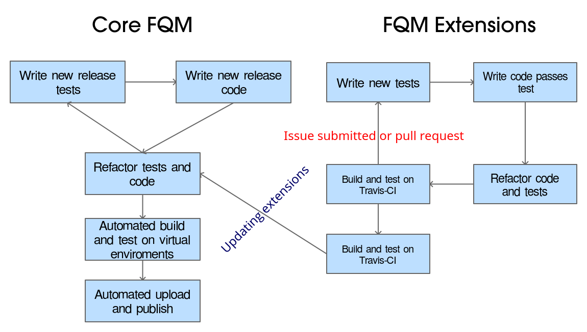

<style>
h1 {
    color: blue !important;
    text-align: center;
    font-stretch: ultra-condensed;
    font-family: 'Times New Roman', Times, serif !important;
    font-weight: 600 !important;
    text-transform: capitalize !important;
    text-shadow: -4px 4px 20px brown !important;
    margin-bottom: 0% !important;
}
p {
    color: brown;
    text-align: left;
    font-stretch: ultra-expanded;
    font-family: 'Trebuchet MS', 'Lucida Sans Unicode', 'Lucida Grande', 'Lucida Sans', Arial, sans-serif !important;
}
body {
    background-color: cornsilk;
    box-shadow: inset 0 0 20px black;
}
img {
    cursor: zoom-in;
    height: 400px;
}
img:hover {
    height: 650px;
}
img.qr {
    height: 300px;
    width: 400px;
}
a {
    font-stretch: ultra-expanded;
    font-weight: bold;
}
li {
    list-style-type: square;
}
code {
    color: green;
}
pre:hover {
    cursor: zoom-in;
    font-size: 70%;
}

@keyframes beat {
  0%   { color: blue; font-size:  }
  50% { color: rgb(255, 46, 46); font-size: 150%; }
  100%   { color: blue; }
}

.theEnd {
  animation: beat 3s infinite;
}

.typeWriter {
    color: #000;
    font-family: monospace;
    overflow: hidden;
    white-space: nowrap;
    margin: 0 auto;
    letter-spacing: .15em;
    margin-top: 0% !important;
    padding-top: 0% !important;
}

.typeIt1 {
    animation: typing1 10s steps(30, end) infinite;
}

.typeIt2 {
    animation: typing2 10s steps(30, end) infinite;
}

.typeIt3 {
    animation: typing3 10s steps(30, end) infinite;
}


@keyframes typing1 {
  0% { width: 0 }
  10% { width: 100% }
}

@keyframes typing2 {
    0% { width: 0 }
    10% { width: 0 }
    20% { width: 100% }
}

@keyframes typing3 {
    0% { width: 0 }
    20% { width: 0 }
    30% { width: 100% }
}
</style>

<!-- slide id="1" -->
# Test driven Development <br /> <br />
- What's it ? _First comes testing_ <br /><br /> <!-- .element: class="fragment" data-fragment-index="1" -->
- Why TDD ? _Untested code is broken code_ <br /><br /> <!-- .element: class="fragment" data-fragment-index="2" -->


<!-- slide id="2" -->
# 
1. Red: Writing and failing tests <!-- .element: class="fragment" data-fragment-index="1" -->
2. Green: Writing code and passing tests <!-- .element: class="fragment" data-fragment-index="2" -->
3. Refactor: Improving code and tests <!-- .element: class="fragment" data-fragment-index="3" -->

<!-- slide id="2" -->
# unit testing frameworks <br /> <br />
- What's UnitTesting ? Units and Cases <!-- .element: class="fragment" data-fragment-index="1" -->
`Class [ Method_1, Method2, ... ] => Case [ Unit_1, Unit_2, ... ]` <br /> <br /> <!-- .element: class="fragment" data-fragment-index="2" -->
- Why a framework ? <i>Not to reinvent the wheel</i> <!-- .element: class="fragment" data-fragment-index="3" -->

<!-- slide id="3" -->
<p class="typeWriter typeIt1">
"Sounds like a headache to me,
<p class="typeWriter typeIt2">
Why the hell would you need all
</p>
<p class="typeWriter typeIt3">
that useless testing ?!"
</p><br />

<!-- slide -->
> How about a full-stack, web-based cross-platform cross-browser support desktop application ?
- What's FQM ? <br /> <!-- .element: class="fragment" data-fragment-index="1" -->
- What can go wrong ? <!-- .element: class="fragment" data-fragment-index="2" -->
`6000 > JS lines in * OS && browsers`
`5000 > CSS && LESS * OS && browsers`
`4500 > Python lines CRUD with SQLite`
`QT GUI QThreading support in * OS`
`Async Gevent webserver in * OS`
`POS printers support in * OS`

<!-- slide -->
# 
- Average of 3 critical errors per release <!-- .element: class="fragment" data-fragment-index="1" -->
- 4 major release, 12 minor release <!-- .element: class="fragment" data-fragment-index="2" -->
- Whole life cycle repeated 16 times ! <!-- .element: class="fragment" data-fragment-index="3" -->
- Testing and Building repeated 96 times ! <!-- .element: class="fragment" data-fragment-index="4" -->

<!-- slide -->
# 
- %30 > of code became standalone "units" or extensions separately maintained tested <!-- .element: class="fragment" data-fragment-index="1" -->
- %130 less time spent with new release cycle <!-- .element: class="fragment" data-fragment-index="2" -->
- 0 minor releases and 0 repeats ! <!-- .element: class="fragment" data-fragment-index="3" -->

<!-- slide -->
> Speed and time threshold for TDD
# 

<!-- slide id="5" -->
<h1 class="theEnd">Let's be practical</h1>

<!-- slide -->
# pythonic example:
```python
@function_parameters
def print_something(input):
    """To print and return the input ((input:str))"""
    print(input)
    return input
```

<!-- slide id="4" -->
# pythonic example:
```python 
from  simple_functions import print_something
from unittest import TestCase, main

class Testing_Something(TestCase):
    def setUp(self):
        """ Setting initial variables """
        self.testing_value = "Something to test"
    def test_printing_something(self):
        """ To test the value printed """
        self.assertEqual(self.testing_value,
            print_something('Something to test'))
main()
```

<!-- slide id="6" -->
<p class="typeWriter typeIt1">
"Nice story bro, but that's just
<p class="typeWriter typeIt2">
functional testing. How about ?
</p>
<p class="typeWriter typeIt3">
Inspection, Performance, Reporting !"
</p>

<!-- slide id="7" -->
# Inspection ?
<br />

- <i>"Test coverage"</i> <br />
`coverage run --source='./simple_functions' test_simple_functions.py`
`coverage report`

<!-- slide id="8" -->
# Performance ?
<br />

- <i>"Tweaking unittest"</i> <br />
`Uncomment simple_functions`
`python test_simple_functions_more.py`

<!-- slide id="9" -->
# Reporting: 
<br />

- <i>"Test coverage export"</i> <br />
`coverage html`
`copy link && view on Open browser`

<!-- slide id="10" -->
<h1 class="theEnd">the end</h1> <br /><br />

- Source code and presentation can be found on:<br /><br />
<center>
<a href="https://github.com/mrf345/TDD">github.com/mrf345/TDD</a>
<br />

</center>