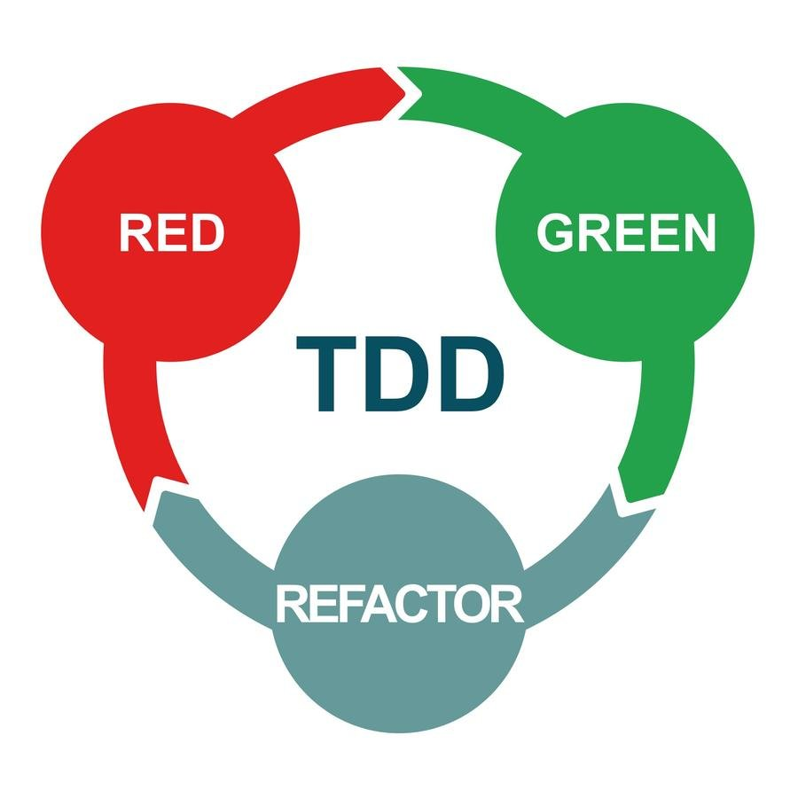
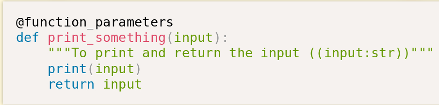
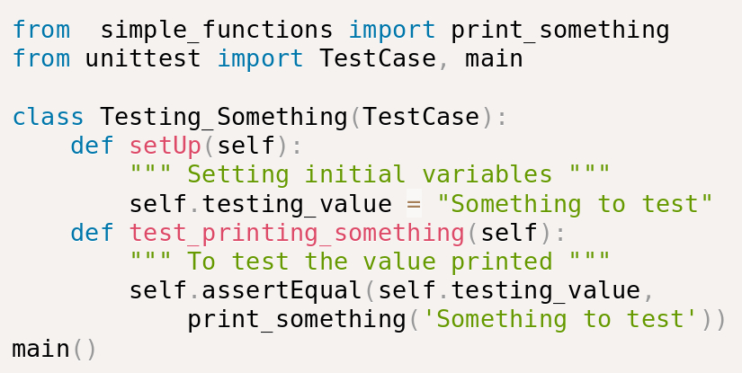
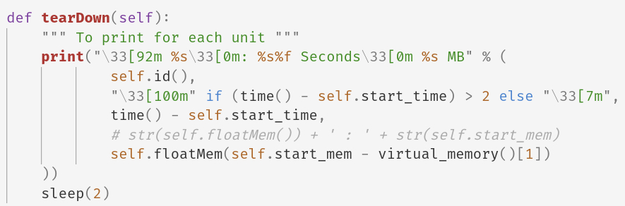
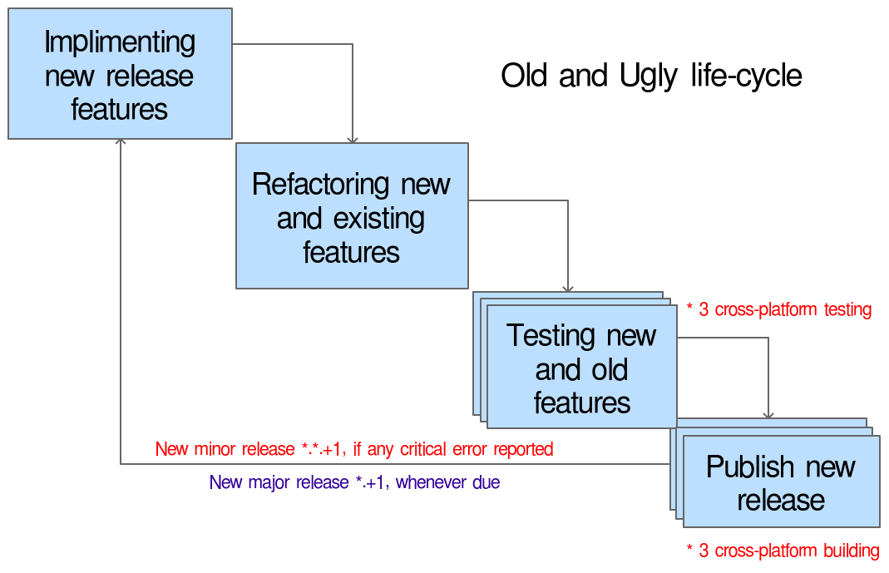
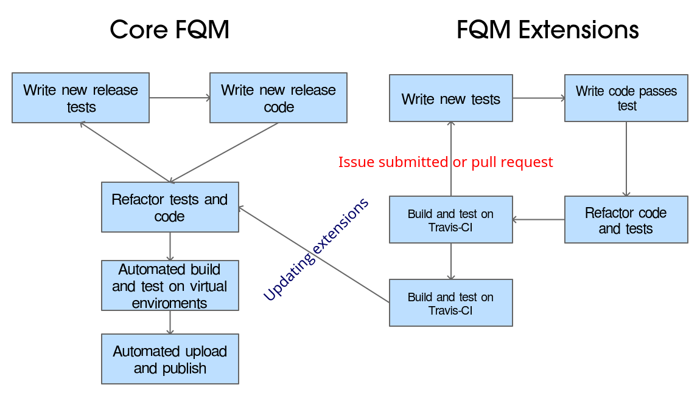

#Test Driven Development for verification and validation
 
### masters of software enginering
### mohamed feddad
### ID: 110025553

    

#### abstract:
Test Driven Development or TDD is a newly emerging a form of software development life cycle that highly emphasize the testing of a software as the solely most important phase on-which any software life cycle should begin and end with.
In this report i will attempt to highlight the main features of verification and validation that TDD has to offer and compare it with a practical example to a waterfall life cycle with high emphasis on its testing phase.

 

#### introduction:
To define TDD in simple words: It is the process of minimizing the life cycle and its requirements into small test units, that will run in the start and end of each life cycle. The main phases to a typical TDD are three pashes `1. Red`, `2. Green` and `3. Refactoring`.[1]   
 

Each phase of the three servers a purpose that involves testing. The first phase consist of writing the first tests that embodies the requirements or the desired outcomes of our software. Simply the idea of writing a piece of code that meant to test another piece of code that's yet to be written, might seem foreign to many. But it has a crucial use, since it marks the beginning and end of the cycle. Therefor the first phase is meant to be failed since there's not yet any code to be tested, However the action of setting the scope of a test and the parameters itself is sufficient enough for it to be later on optimized and refactored in the third phase.
After failing the set tests in the first phase, the code to pass initial tests will be written in the second phase. Good to notice that in most TDD setups the processes of running tests is automated whenever a change occurs on the source code an automatic tests will be ran to verify that the changes made have not corrupt the rest of code. Such automated setup can be achieved with the assistance of a version or source control systems. After passing the tests on the second phase, A phase of refactoring and improving the code added to pass the test and the tests them selves are due in the third phase of refactoring. 

    

#### methodology:
Case study based on an implementation of TDD on a waterfall based project. The case study is based on Free Queue Manager FQM [2], an open-source software aims to ease the process of organizing lines and queues. The project is currently under going the process of shifting to a fully automated TDD life-cycle so the case study mainly aims to measure the performance difference gained from a partial implementation of a TDD life-cycle and applying the principles of modular programming. Emphasizing the performance difference by highlighting the main gained portions on time and reduction of tasks. So to demonstrate a basic example of unit testing standard that was followed in implementing TDD on FQM, Hereafter is a basic function and followed by Unit test that aim to test it with full coverage:

- Simple function [3]    

  
- Simple unit test Case [4]    

Another method of validation and verification that will be implemented is code coverage. Its a TDD method used to inspect which parts of the code are not yet covered by tests. The uncovered code is more likely to cause issues an bug in the future. Code coverage can be generated and used depending on the environment and platform generally code coverage assistant libraries are coupled with Unit testing framework, However in our case it's not, therefor we will be utilizing `coverage.py` simple test coverage detection tool coupled with the Python default unit testing library shown in the previous code snippets UnitTest.

Furthermore, for the purpose of verifying the performance of our tests an additional enhancement is added to the default UnitTest library. So it will enable us to verify the speed and memory consumption of each performed unit test, with additional feature of full link tracing to the Test Suite file. 

- Enhancements on the test case [5]    

    

#### results:
Performance of the waterfall life-cycle in comparison to the TDD life-cycle. Average of 3 critical errors per release, 4 major release and 12 minor release, that means the Whole life cycle repeated 16 times. Testing and Building repeated 96 times overall.

Implementing TDD "partially" resulted in significant decrees in overall testing time, since its automated and decrease in minor release due to decrease in critical error occurrences. Furthermore, %30 of FQM code became standalone "units" or extensions separately maintained and tested. And %30 less time spent with overall new release cycle. 0 minor releases and 0 repeats of any of the life-cycle phase it means 0 redundancy.

    

#### conclusion:
In conclusion TDD has all the tools that makes for great Verification and Validation experience, although it's most suited for certain cases as the results has shown the massive increase in performance and shortening of development time as well as improvement on reproducablity specially for cross-platform testing and deployment. Nevertheless, TDD comes with massive learning or implementation curve that might discouraging and off putting to most small to mid size non cross-platform software projects.

    

#### references:
`[1] Test Driven Development Definition (http://agiledata.org/essays/tdd.html)`  
`[2] FQM - Free Queue Manager, open-source project (https://fqms.github.io)`  
`[3] simple_function implementation source code (https://github.com/mrf345/TDD/simple_functions/__init__.py)`  
`[4] unit test implementation source code (https://github.com/mrf345/TDD/test_simple_function.py)`  
`[5] enhanced unit test implementation source code (https://github.com/mrf345/TDD/test_simple_function_more.py)`  